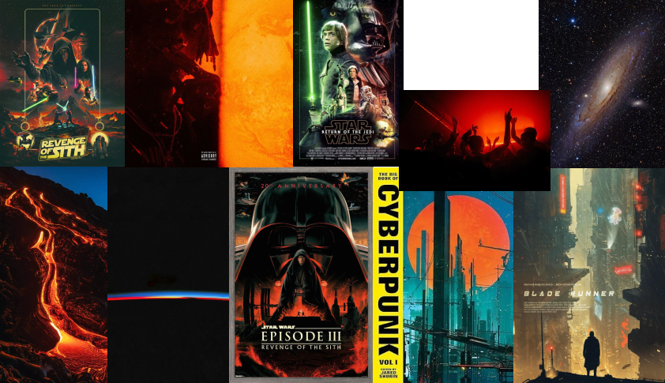

# StarWars - Episode X

## Binôme
- Anthony LOPES
- Florian DECODTS

## Instructions pour lancer le projet
1. Clonez le dépôt ou téléchargez les fichiers.
2. Ouvrez le dossier `StarWars` dans votre éditeur ou navigateur.
3. Lancez simplement `index.html` dans votre navigateur (aucune installation requise).
4. Activez le son pour profiter de l'expérience complète.

## Moodboard
 

## Concept

Ce projet est une expérience interactive réalisée pour célébrer la sortie du nouveau film **Star Wars**.  
Il reprend les codes visuels emblématiques de la saga :
- **Le texte défilant** en perspective, inspiré de l’intro mythique de chaque épisode.
- **L’apparition du titre** façon Star Wars.
- **Un fond étoilé animé** pour plonger l’utilisateur dans l’espace.
- **Des planètes et la Death Star** animées, avec effets de perspective et de lumière.
- **Une ambiance sonore** pour une immersion totale.

L’ensemble rend hommage à l’univers Star Wars, en s’inspirant de ses génériques et de son esthétique spatiale, pour annoncer la sortie du prochain film :  
**"Rise of the Shadows"** – uniquement au cinéma, dans toutes les galaxies, dès le 26 mai 2026.
